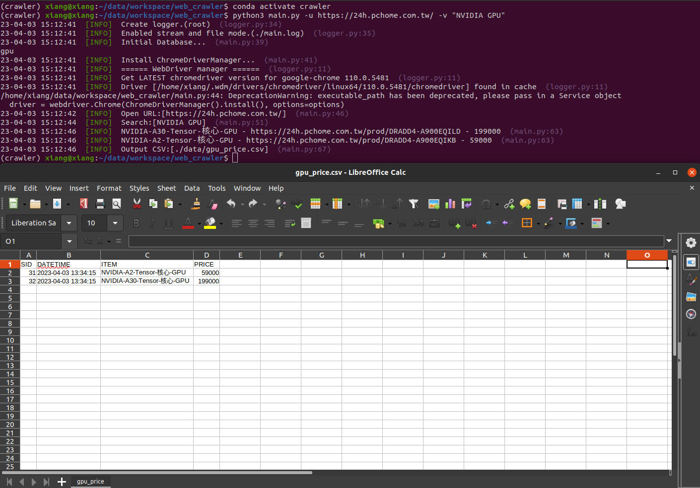

# Web Crawler

## Getting Started
- Support *"PCHOME"* GPU INFO in this code.

### Pre-requirements
```shell
sudo chmod u+x ./env/*.sh
sudo ./env/env.sh
```

### Setting env
```shell
sudo chmod u+x ./env/*.sh
sudo ./env/run.sh
```

### DB GUI - Phpmyadmin
```shell
sudo apt update
sudo apt-get install -y phpmyadmin
sudo nano /etc/apache2/apache2.conf ->

# add this line somewhere
Include /etc/phpmyadmin/apache.conf

sudo phpenmod mbstring
sudo systemctl restart apache2
```
- url: http://localhost/phpmyadmin/

### Demo
```python
python3 main.py -u https://24h.pchome.com.tw/ -v "NVIDIA GPU"
```
- u: The URL of the crawler.
- v: The value of search.

<div align="center">
  
</div>

## Reference
- Mariadb
    - https://mariadb.com/